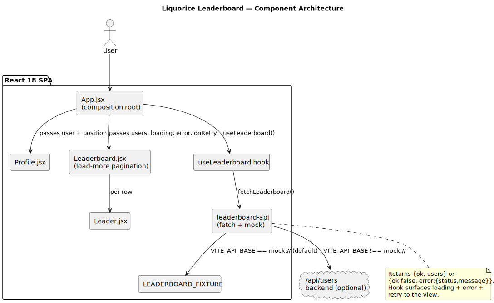
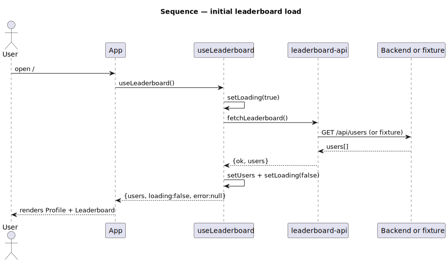
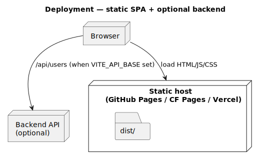

# Liquorice Hygienica · Leaderboard

A small React SPA showing the Hygienica program leaderboard and the current
user's profile + position.

[](https://github.com/tzone85/liquorice-client/actions/workflows/ci.yml)


Modernized from the original React 16 + react-scripts 3 + jQuery-leaning
stack: now React 18 + Vite + ESM, with functional components, a dedicated
data-fetch hook, an injectable API client, and tests at unit + e2e levels.

## Bugs fixed during the rewrite

| File / line (original)           | Bug                                                                                          |
|----------------------------------|----------------------------------------------------------------------------------------------|
| `src/App.js:8` and `:23`         | `<fragment>` (lowercase, treated as unknown HTML element). Replaced with `<>` / `React.Fragment`. |
| `src/Components/Leaderboard.js:27` | `<fregment>` typo — same root cause as above.                                              |
| `src/Components/Leaderboard.js:12-21` | `fetch()` called in the constructor — runs again every re-render of a parent, can leak setState calls after unmount. Moved to a `useEffect` inside a dedicated `useLeaderboard` hook. |
| `src/Components/Leaderboard.js:13` | Hardcoded `http://localhost:3000/api/users`. Replaced with `VITE_API_BASE` env, defaulting to an in-memory fixture. |
| `package.json` | Mixed CRA + Next.js 9 + webpack 4 — none working together. Replaced with Vite. |
| Everywhere                       | Class components → functional components.                                                    |

## Architecture

### Component view



### Sequence — initial load



### Deployment



Diagrams are PlantUML under `docs/architecture/*.puml`; rendered SVGs are
checked in. Regenerate with `./scripts/render_diagrams.sh` (`brew install plantuml`).

## Quick start

```bash
npm install
npm run dev          # vite dev server on :5173 — uses bundled fixture
npm run build        # produces dist/
npm run preview      # serves dist/ on :4173
npm test             # vitest + coverage
npm run test:e2e     # playwright vs the preview server
npm run lint         # eslint flat-config
```

Pointing at a real backend:

```bash
VITE_API_BASE=https://api.example npm run dev
# expects GET ${VITE_API_BASE}/api/users → [{id, firstName, lastName, level, points, avatarUrl}]
```

## Project layout

```
src/
├── main.jsx                       # entrypoint
├── App.jsx                        # composition root
├── components/
│   ├── Header.jsx / Footer.jsx
│   ├── Profile.jsx                # current user card
│   ├── Leaderboard.jsx            # load-more list
│   └── Leader.jsx                 # single row
├── services/
│   ├── leaderboard-api.js         # fetch wrapper; mock:// → fixture
│   └── use-leaderboard.js         # React hook (loading/error/refresh)
├── fixtures/leaderboard.js        # in-memory data for offline + tests
└── styles/main.css
tests/
├── setup.js                       # jest-dom matchers
├── unit/                          # vitest + React Testing Library
└── e2e/                           # playwright + chromium
docs/architecture/                 # PlantUML + SVGs
.github/workflows/ci.yml
```

## Tests

| Suite | Count | What |
|---|---|---|
| `tests/unit/leaderboard-api.test.js` | 6 | fixture vs real fetch, error branches |
| `tests/unit/use-leaderboard.test.jsx` | 3 | loading → success / error / refresh |
| `tests/unit/Leaderboard.test.jsx` | 4 | loading, error+retry, load-more, empty |
| `tests/unit/Profile.test.jsx` | 3 | null user, name+position, default avatar |
| `tests/e2e/leaderboard.spec.js` | 2 | full SPA boot, load-more reveals more rows |
| **Total** | **18** | 80% lines / 75% branches gate enforced |

## License

MIT — see [LICENSE](LICENSE).
